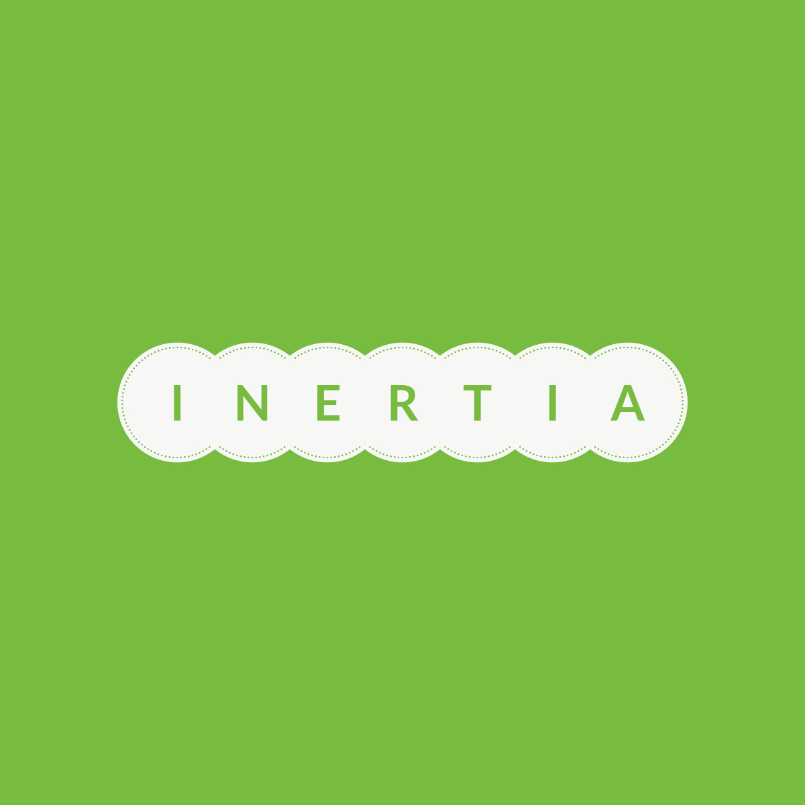

## Inertia:

`Inertia` is in very early alpha stages but the goal is to provide an easy to use, robust and flake free automation
framework for modern web applications in python.  Inertia builds on top of microsofts `playwright` library and
builds in some extra goodies.  Initially `Inertia` will be a synchronous API.

>Inertia was developed using pytest as it's test runner and has a `pytest-inertia` plugin that exposes inertia
>through a series of fixtures.  Inertia is suitable for any underlying test runner of course however some boilerplate
> will need to be implemented by you.

The main features of inertia are (and will be):

+ Batteries included test runner plugins (pytest etc).
+ Reliability as the #1 priority.
+ Scalable, distributed testing.
+ User friendly error messages.
+ Extensibility at the core.
+ Much more.
