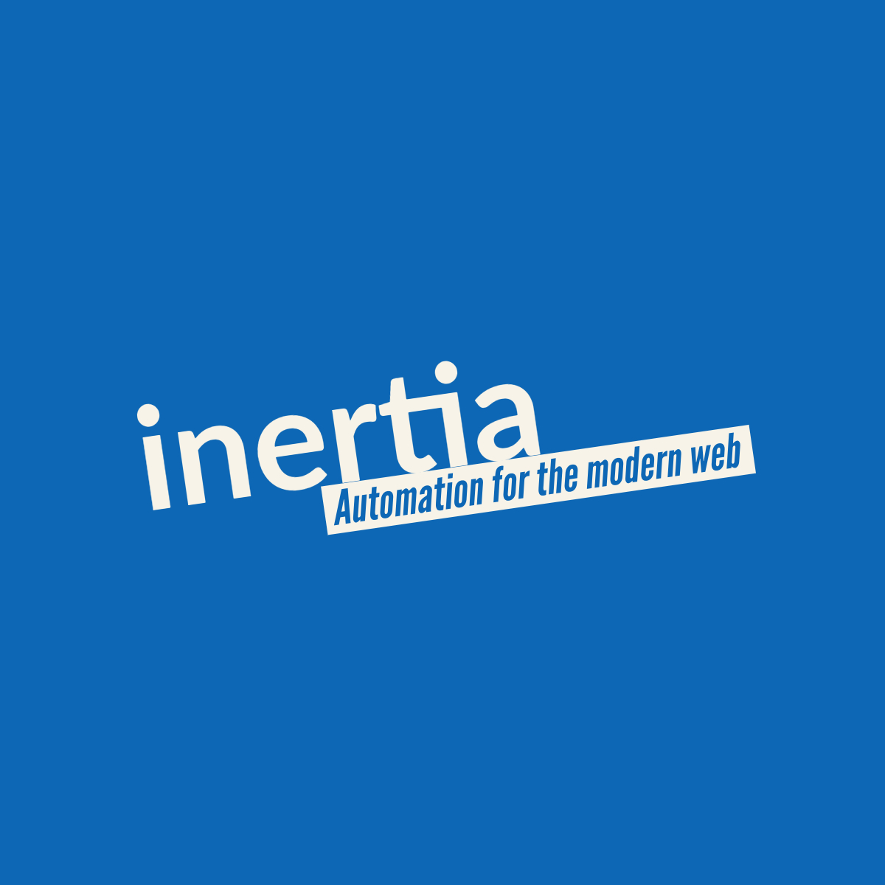

## Inertia:

Inertia is python test automation framework built with the idea of reliably testing web applications from an
integration and end to end perspective.  `Inertia` operates on top of the python playwright implementation and
adds a lot of goodies, including a fully functional pytest plugin to get up and running quickly.

>Inertia was developed using pytest as it's test runner and has a `pytest-inertia` plugin that exposes inertia
>through a series of fixtures.  Inertia is suitable for any underlying test runner of course however some boilerplate
> will need to be implemented by you.

The main features of inertia are (and will be):

+ To be decided.
+ To be decided 2.
+ To be decided 3.
